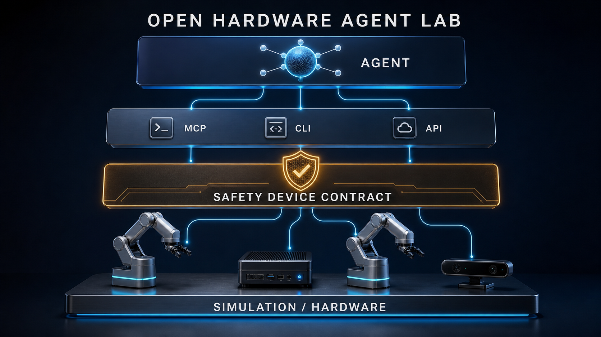

# Open Hardware Agent Lab



> 以 Seeed reBot 双机械臂为第一套参考硬件，探索安全、可复现、模型无关的 AI-to-hardware 接口。

**清乐智能 · Physical AI for Science** — [访问项目网站](https://xychendave.github.io/open-hardware-agent-lab/)

这是一个面向两台 Seeed Studio reBot 机械臂的安全起步项目。它先把 Anthropic 已公开介绍的 MHS 核心概念——设备发现、统一 `read`/`write`、自然语言硬件描述、设备级安全限制——做成可运行的仿真，再通过 MCP 暴露给 Claude、DeepSeek Harness 或其他智能体。

> 当前状态：**MHS-ready prototype，不是官方 MHS 实现。** 截至 2026-09-01，MHS 仍是申请制研究预览，规范与 SDK 尚未公开。拿到官方预览后，计划只替换协议/驱动适配层。

本仓库是独立社区研究项目，与 Anthropic、DeepSeek AI、Seeed Studio 或 Hugging Face 没有隶属或背书关系。

## 项目文档

- [项目过程日志](docs/PROJECT_LOG.md)
- [系统架构](docs/ARCHITECTURE.md)
- [DeepSeek Harness 接入方案](docs/DEEPSEEK_HARNESS.md)
- [公开路线图](ROADMAP.md)
- [架构决策记录](docs/decisions/)
- [面向后续 AI Agent 的工程约定](AGENTS.md)

## 现在可以演示什么

- 自动发现 `reBot Arm B601-DM` 和 `reBot Arm B601-RS` 两台虚拟设备。
- 读取设备状态、标准化关节位置、使能状态和急停状态。
- 所有写操作默认 dry-run，不会移动机械臂。
- 运动必须同时满足：未触发急停、已显式使能、`apply=true`、`confirmed=true`。
- 单次关节变化限制为 `0.15`，越界命令在 driver 层拒绝。
- 生成双臂物体交接计划，但当前永远只做 dry-run。

## 推荐学习顺序

1. **单臂 bring-up**：组装、供电、电机 ID、零点和急停。先用 MotorBridge 单独验证每个关节。
2. **LeRobot 接口**：理解 `connect → get_observation → send_action → disconnect`，完成 Leader/Follower 遥操作。
3. **数据闭环**：录制一个简单任务、回放、检查数据，再训练 ACT/SmolVLA 等策略。
4. **MHS 设备层**：把关节状态、动作、物理属性和安全边界变成可发现的设备 slot。
5. **MCP 编排层**：让智能体读取状态、生成计划和调用受限动作；高速控制仍由 LeRobot 策略或确定性代码完成。
6. **双臂 Demo**：先做仿真交接，再做真实双臂标定、碰撞区和人工确认。

不要一开始就训练 VLA，也不要让大模型逐帧直接输出电机控制。第一阶段的目标是一个可靠、可复现、随时能急停的控制链路。

## 在这台 Mac 上运行仿真 Demo

```bash
cd /Users/dave/Desktop/physical_ai
uv sync --extra dev --python 3.12
uv run pytest
uv run mcp dev server.py
```

MCP Inspector 打开后，可以依次调用：

1. `discover_devices`
2. `read_device(device_id="rebot-dm", slot="state")`
3. `write_device(device_id="rebot-dm", slot="position", value={"shoulder_pan": 0.1})`
4. `plan_two_arm_handoff(from_device="rebot-dm", to_device="rebot-rs")`

第 3 步没有传入 `apply=true`，因此只返回预演结果。

也可以把本地 stdio server 接入支持 MCP 的宿主：

```json
{
  "mcpServers": {
    "rebot-mhs-lab": {
      "command": "uv",
      "args": [
        "run",
        "--directory",
        "/Users/dave/Desktop/physical_ai",
        "python",
        "server.py"
      ]
    }
  }
}
```

## 接入 DeepSeek Harness

DeepSeek Harness 已提供官方 MCP client 插件，因此第一阶段不需要直接修改 Harness。我们把本仓库作为独立 MCP hardware server，通过 `@deepseek-ai/dsh-mcp-client` 接入。示例配置位于 [.dsh/cordis.patch.yml](.dsh/cordis.patch.yml)。

```bash
npx @deepseek-ai/dsh web
```

DeepSeek Harness 仍处于 developer preview，插件版本应与宿主版本保持一致。详细步骤和后续原生插件路线见 [docs/DEEPSEEK_HARNESS.md](docs/DEEPSEEK_HARNESS.md)。

## 接真实机械臂前的环境选择

- 当前电脑是 Apple Silicon Mac，适合运行本项目、MCP 和仿真。
- B601-DM 未来可通过串口桥/MotorBridge 接入，但 Seeed 的完整 LeRobot 教程以 Ubuntu 物理机为主。
- B601-RS 的 follower 教程使用 SocketCAN；真实控制建议放在 Ubuntu 22.04 或 Jetson 上，而不是直接放在 Mac 上。
- 推荐架构：Mac 运行 Claude/MCP 客户端，Ubuntu/Jetson 贴近机械臂运行 driver；两者通过受限的网络接口通信。

## 与真正 MHS 的迁移边界

目前的 `SimulatedArmDriver` 只提供三件事：

```text
discover()          设备能力、物理属性、安全限制
read(slot)          状态读取
write(slot, value)  带设备级校验的写入
```

官方 MHS SDK 可用后，新建 `OfficialMHSReBotDriver` 实现同样的行为，把现有 MCP 工具和双臂编排保留下来。真实 LeRobot 适配器则把标准化状态映射到 `get_observation()` / `send_action()`。

## 真实硬件安全门槛

- 固定底座、清空工作区并准备物理急停。
- 初次调试保持至少一米距离，限制速度、扭矩和单步变化。
- 禁止带电插拔电源或信号线。
- 断电、掉线或反馈异常后，先停止程序并重新回零，不能从旧状态继续。
- 真实运动不得沿用示例中的标准化位置；必须根据各自校准数据、关节限位和碰撞模型生成。

## 资料

- [Anthropic：Model Hardware Standard 研究预览](https://www.anthropic.com/news/model-hardware-standard-research-preview)
- [MHS 官网与申请入口](https://modelhardwarestandard.com/)
- [Seeed reBot B601-DM 快速入门](https://wiki.seeedstudio.com/cn/rebot_b601_dm_getting_started/)
- [Seeed reBot B601-RS 快速入门](https://wiki.seeedstudio.com/cn/rebot_b601_rs_getting_started/)
- [Seeed reBot 开源仓库](https://github.com/Seeed-Projects/reBot-DevArm)
- [Hugging Face LeRobot](https://github.com/huggingface/lerobot)
- [DeepSeek Harness](https://github.com/deepseek-ai/deepseek-harness)

## 授权状态

仓库目前公开用于审阅、学习和讨论，但尚未选择开源许可证。在许可证正式确定之前，请不要假定拥有复制、修改、分发或商业使用本代码的权利。这样可以在创业项目早期保留专利、双许可证和商业授权的选择空间。
