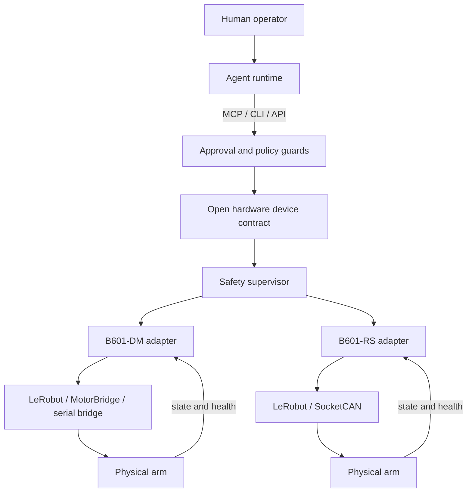

# Architecture

## Goal

Provide a model-agnostic, auditable interface between AI agents and programmable physical equipment, beginning with two Seeed reBot arms.



## Layer responsibilities

### Agent runtime

Claude, DeepSeek Harness or another model plans tasks, interprets observations and chooses high-level tools. It is replaceable and is not trusted as a safety boundary.

### Transport and harness adapters

MCP is the first transport. DeepSeek Harness consumes the MCP server through its official MCP client plugin. Future adapters may expose the same contract through CLI, HTTP or an official MHS transport.

### Open hardware device contract

The stable project seam is deliberately small:

```text
discover()          -> capabilities, physical metadata, slots, limits
read(slot)          -> typed current state
write(slot, value)  -> validated proposal or explicit application
```

This shape is informed by Anthropic's public MHS description but is independently implemented. It is not a reverse-engineered or official MHS specification.

### Safety supervisor

The supervisor owns invariants that prompts cannot waive:

- mode is simulation unless a real adapter is explicitly selected;
- enable, confirmation and apply are separate conditions;
- position, speed, torque and workspace limits are device-side checks;
- stale or missing feedback blocks motion;
- emergency stop disables actuators and remains latched;
- multi-arm zones require mutual exclusion.

### Device adapters

Adapters translate the stable contract into LeRobot, MotorBridge, ROS 2 or vendor SDK calls. They own calibration, unit conversion, connection health and hardware-specific limits.

### Real-time control

The inner control loop belongs to deterministic controller code or a trained policy running at an appropriate frequency. A cloud LLM may select a policy, waypoint sequence or recovery procedure, but it must not issue individual motor torques over normal inference latency.

## Trust boundaries

Model output, prompts, camera content, remote MCP clients and downloaded policies are untrusted. Device firmware, adapters and safety configuration are privileged. A command passing through the harness is still revalidated by the driver.

## Repository layout

```text
src/rebot_mhs_lab/       reference Python device contract and MCP server
config/                  public example descriptors; no unique identifiers
tests/                   safety and protocol behavior
.dsh/                    DeepSeek Harness project integration
docs/                    architecture, history and decisions
```
